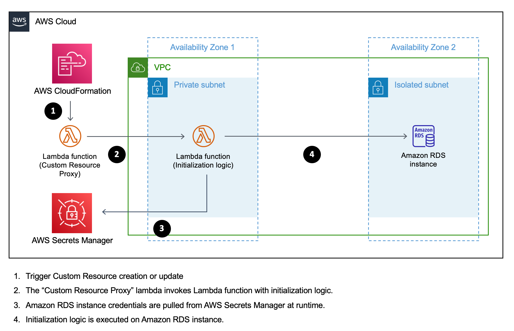

# Supporting Amazon RDS initialization using CDK

## Introduction
The source code and documentation in this repository describe how to support Amazon RDS instances initialization using CDK and CloudFormation Custom Resources. For the compute layer, it uses a Lambda function implemented in Node.js which is able to run custom SQL scripts with the purpose of initializing the Amazon RDS instance, but also to execute custom commands supported by the [Node.js client for MySQL](https://www.npmjs.com/package/mysql).  

This approach is also described in more details in the following AWS blog post: https://aws.amazon.com/blogs/infrastructure-and-automation/use-aws-cdk-to-initialize-amazon-rds-instances/ 

> While we focus on Amazon RDS for MySQL instances initialization, the concept being described can be applied to any other supported RDS engine.  
 
### Potential use cases
- Initialize databases.
- Initialize/maintain users and their permissions.
- Initialize/maintain stored procedures, views or other database resources.
- Execute other custom logic as part of a resource initialization process.
- Improve segregation of duties/least privilege by providing a flexible hook in the IaC, in order to manage RDS instances initialization.
- Initialize database tables. (see note below)
- Seed database tables with initial datasets. (see note below)

> NOTE: Please be aware that application specific initilization logic (for example: database tables structure and initial seeding of data) is a concern that is commonly managed on the application side. Overall, we advice to keep infrastructure initialization/management separated from application specific initialization. 

### Pre-Requisites
- Node.js v14+ installed on your local machine: https://nodejs.org/en/download/
- Docker installed on your local machine: https://docs.docker.com/get-docker/
- CDK v1.122+ installed and configured on your local machine: https://docs.aws.amazon.com/cdk/latest/guide/getting_started.html

### Installation and Deployment steps
- Git clone or download the repository:  
  https://github.com/aws-samples/amazon-rds-init-cdk.git
- Install NPM dependencies on project directory:  
  ```
  npm install
  ```
- Deploy the solution on your configured AWS account:  
  ```
  cdk deploy
  ```

> NOTE: For demo purposes, the example CDK stack `demos/rds-init-example.ts` creates a new VPC/Subnets to provision the RDS instance and Lambda funtions. In case you would prefer to re-use existing VPC and Subnets, you can easily do so by importing an existing VPC resource: https://docs.aws.amazon.com/cdk/api/latest/docs/@aws-cdk_aws-ec2.Vpc.html#static-fromwbrlookupscope-id-options

#### Cleanup 
To avoid incurring future charges, delete the provisioned CDK Stack and related resources. This can be done by executing the following command and subsequent steps:  
```
cdk destroy
```

## Technical implementation
In order to achieve custom logic execution during the deployment flow of a CDK stack, we make use of CloudFormation Custom Resources. In the context of CDK, we use the `AwsCustomResource` construct to invoke a deployed lambda containing the RDS initialization logic (execute SQL scripts).

> Optionally you can read more about making custom AWS API calls using the AwsCustomResource construct: https://docs.aws.amazon.com/cdk/api/latest/docs/custom-resources-readme.html#custom-resources-for-aws-apis

### Client implementation based on Node.js
To execute SQL scripts on the provisioned Amazon RDS instance we make use of the `mysql` NPM module, it allow us to easily execute custom SQL scripts or any other support client -> server command:
```js
const mysql = require('mysql')
const connection = mysql.createConnection({
  host,
  user,
  password,
  multipleStatements: true
})
connection.connect()

connection.query("SELECT 'Hello World!';", (err, res) => {
  // ...
})
```
> Full Node.js implementation example for MySQL is available at `./demos/rds-init-fn-code/index.js`

### Docker container images for Lambda functions
To avoid unnecessary overhead dealing with software dependencies, we promote the usage of Docker container images to package the RDS initialization Lambda function code. 

Docker container images are automatically managed by CDK and there is no need to interact with ECR repositories, simply use: 
```js
const fnCode = DockerImageCode.fromImageAsset(`${__dirname}/your-fn-code-directory`, {})
```
> You can see a Lambda function code example inside the `./demos/rds-init-fn-code` directory.  

### High level solution overview


> NOTE: For simplicity, Amazon S3, Amazon ECR and Amazon CloudWatch configurations are ommitted from the diagram.  

### The CdkResourceInitializer construct

The `CDKResourceInitializer` CDK construct generalizes the proposed solution, it encapsulates the integration requirements behind `CloudFormation Custom Resources` and `CDK`, to support the execution of AWS Lambda functions with custom initialization logic. 

#### Usage (full example)
```ts
import * as cdk from '@aws-cdk/core'
import { CfnOutput, Duration, Stack, Token } from '@aws-cdk/core'
import { CdkResourceInitializer } from '../lib/resource-initializer'
import { DockerImageCode } from '@aws-cdk/aws-lambda'
import { InstanceClass, InstanceSize, InstanceType, Port, SubnetType, Vpc } from '@aws-cdk/aws-ec2'
import { RetentionDays } from '@aws-cdk/aws-logs'
import { Credentials, DatabaseInstance, DatabaseInstanceEngine, DatabaseSecret, MysqlEngineVersion } from '@aws-cdk/aws-rds'

export class RdsInitStackExample extends Stack {
  constructor (scope: cdk.App, id: string, props?: cdk.StackProps) {
    super(scope, id, props)

    const instanceIdentifier = 'mysql-01'
    const credsSecretName = `/${id}/rds/creds/${instanceIdentifier}`.toLowerCase()
    const creds = new DatabaseSecret(this, 'MysqlRdsCredentials', {
      secretName: credsSecretName,
      username: 'admin'
    })

    const vpc = new Vpc(this, 'MyVPC', {
      subnetConfiguration: [{
        cidrMask: 24,
        name: 'ingress',
        subnetType: SubnetType.PUBLIC,
      },{
        cidrMask: 24,
        name: 'compute',
        subnetType: SubnetType.PRIVATE_WITH_NAT,
      },{
        cidrMask: 28,
        name: 'rds',
        subnetType: SubnetType.PRIVATE_ISOLATED,
      }]
    })

    const dbServer = new DatabaseInstance(this, 'MysqlRdsInstance', {
      vpcSubnets: {
        onePerAz: true,
        subnetType: SubnetType.PRIVATE_ISOLATED
      },
      credentials: Credentials.fromSecret(creds),
      vpc: vpc,
      port: 3306,
      databaseName: 'main',
      allocatedStorage: 20,
      instanceIdentifier,
      engine: DatabaseInstanceEngine.mysql({
        version: MysqlEngineVersion.VER_8_0
      }),
      instanceType: InstanceType.of(InstanceClass.T2, InstanceSize.LARGE)
    })
    // potentially allow connections to the RDS instance...
    // dbServer.connections.allowFrom ...

    const initializer = new CdkResourceInitializer(this, 'MyRdsInit', {
      config: {
        credsSecretName
      },
      fnLogRetention: RetentionDays.FIVE_MONTHS,
      fnCode: DockerImageCode.fromImageAsset(`${__dirname}/rds-init-fn-code`, {}),
      fnTimeout: Duration.minutes(2),
      fnSecurityGroups: [],
      vpc,
      subnetsSelection: vpc.selectSubnets({
        subnetType: SubnetType.PRIVATE_WITH_NAT
      })
    })
    // manage resources dependency
    initializer.customResource.node.addDependency(dbServer)

    // allow the initializer function to connect to the RDS instance
    dbServer.connections.allowFrom(initializer.function, Port.tcp(3306))

    // allow initializer function to read RDS instance creds secret
    creds.grantRead(initializer.function)

    new CfnOutput(this, 'RdsInitFnResponse', {
      value: Token.asString(initializer.response)
    })
  }
}
```

#### Configuration options
```ts
export interface CdkResourceInitializerProps {
  vpc: ec2.IVpc
  subnetsSelection: ec2.SubnetSelection
  fnSecurityGroups: ec2.ISecurityGroup[]
  fnTimeout: Duration
  fnCode: lambda.DockerImageCode
  fnLogRetention: RetentionDays
  fnMemorySize?: number // defaults to 128
  config: any
}
```

#### Instance properties
The `CdkResourceInitializer` class exposes the following readonly properties:
```ts
  // response from initializer function once executed (JSON string)
  public readonly response: string
  // reference to the internal AwsCustomResource resource instance
  public readonly customResource: AwsCustomResource
  // reference to the internal Function resource instance
  public readonly function: lambda.Function
```

### Networking configuration

The `CdkResourceInitializer` construct interface requires networking parameters such as VPC and Subnets, the intention here is to allow the initializer function to communicate with RDS instances which are usually provisioned on Private or Isolated subnets within customer managed VPCs.

**IMPORTANT**: Because the initializer function also requires to fetch AWS Secrets (RDS credentials), we require to provision it inside a Subnet with internet access or at least with an existing [VPC endpoint for AWS Secrets Manager](https://docs.aws.amazon.com/secretsmanager/latest/userguide/vpc-endpoint-overview.html) attached. 

### Initializer function execution lifecycle

The initializer function will be executed under one the following circumstances:
- The `CdkResourceInitializer` construct is provisioned the first time.
- The function configuration (networking, code, etc...) changes.
- The `config` parameter changes. 

## Useful CDK commands for this repository

- `cdk deploy` Deploy the CDK stack to your default AWS account/region
- `cdk diff` Compare deployed stack with current local state
- `cdk synth` Generates a synthesized CloudFormation template

## Security

See [CONTRIBUTING](CONTRIBUTING.md#security-issue-notifications) for more information.

## License

This library is licensed under the MIT-0 License. See the LICENSE file.

